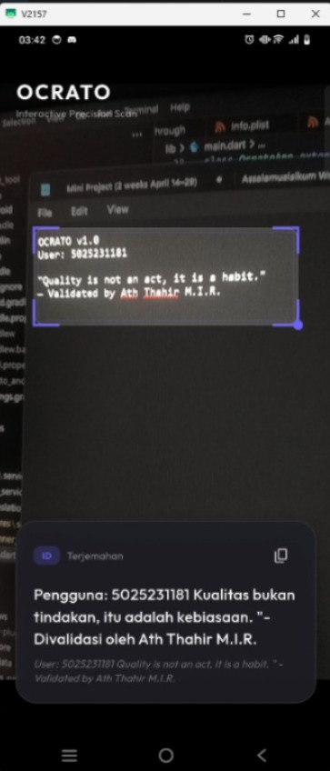
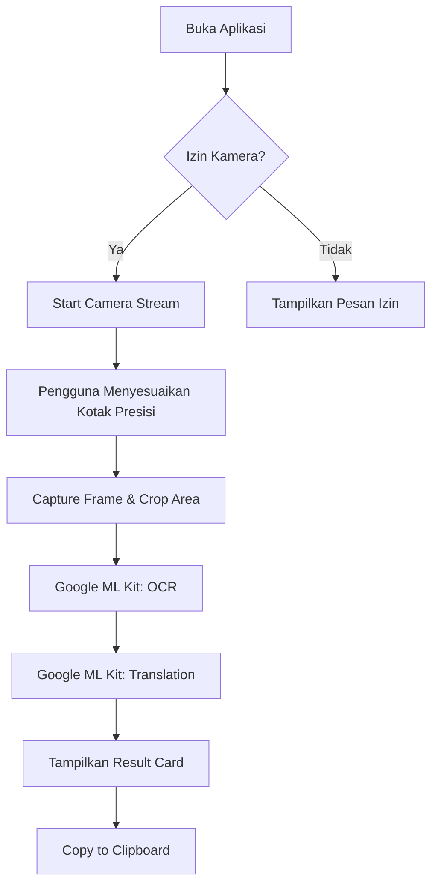

# Ocrato

**Disusun Oleh:**
- **Nama**: Ath Thahir M.I.R.
- **NRP**: 5025231181


**Ocrato** adalah aplikasi pemindai teks (OCR) dan penerjemah instan yang bekerja **100% Offline**. Aplikasi ini mengintegrasikan teknologi **AI (Artificial Intelligence)** dari **Google ML Kit** yang berjalan langsung di dalam perangkat (on-device) untuk melakukan pengenalan teks otomatis dan penerjemahan saraf (Neural Machine Translation) tanpa memerlukan koneksi internet.

<p align="center">
  
</p>

## Alur Kerja Aplikasi

Aplikasi berjalan dengan alur sebagai berikut:

1.  **Inisialisasi**: Aplikasi meminta izin akses kamera dan memuat model AI (OCR dan Translasi). Jika model bahasa belum tersedia, aplikasi akan mengunduhnya sekali saja untuk penggunaan offline permanen.
2.  **Pratinjau Kamera**: Pengguna melihat tampilan kamera secara langsung (*live stream*).
3.  **Area Presisi**: Pengguna mengarahkan kotak indikator ke teks yang ingin dipindai. Kotak ini bersifat interaktif (dapat digeser dan diubah ukurannya).
4.  **Ekstraksi Teks (AI OCR)**: Sistem menangkap *frame* kamera, melakukan pemetaan koordinat, dan mengekstrak teks hanya dari area di dalam kotak menggunakan Google ML Kit.
5.  **Terjemahan Otomatis (AI Translate)**: Teks yang berhasil diekstrak langsung diterjemahkan ke bahasa target menggunakan model saraf lokal.
6.  **Penyajian Hasil**: Hasil terjemahan ditampilkan dalam bentuk kartu mengambang yang elegan dengan opsi untuk menyalin teks.



---

## Fitur Utama

- **Interactive Precision Scan**: Anda dapat menggeser dan mengubah ukuran kotak indikator pemindaian secara dinamis untuk fokus pada teks tertentu.
- **100% Offline Core**: Semua proses pengenalan teks dan terjemahan dilakukan di perangkat tanpa API eksternal. Privasi terjaga dan hemat data.
- **Zero-Lag Interface**: Menggunakan pipeline asinkron untuk memastikan pratinjau kamera tetap berjalan pada 60+ FPS meskipun sedang melakukan pemrosesan berat.
- **Premium Aesthetics**: UI modern dengan animasi halus, haptic feedback, dan desain kartu mengambang yang elegan.
- **Copy-to-Clipboard**: Salin hasil terjemahan secara instan dengan satu ketukan.

## Implementasi AI
Aplikasi ini memanfaatkan teknologi kecerdasan buatan (AI) yang berjalan sepenuhnya secara offline:
- **Text Recognition (OCR)**: Menggunakan model *Machine Learning* dari Google ML Kit untuk mendeteksi baris teks dan mengonversinya menjadi data string secara *real-time*.
- **On-Device Translation**: Menggunakan model *Neural Machine Translation* (NMT) lokal untuk menerjemahkan teks dari bahasa sumber ke bahasa target dengan akurasi tinggi tanpa API cloud.

---

## Tech Stack

- **Framework**: [Flutter](https://flutter.dev)
- **OCR Engine**: [Google ML Kit Text Recognition](https://developers.google.com/ml-kit/vision/text-recognition)
- **Translation Engine**: [Google ML Kit On-Device Translation](https://developers.google.com/ml-kit/language/translation)
- **Camera Handling**: [Camera Plugin](https://pub.dev/packages/camera)
- **Animations**: [Flutter Animate](https://pub.dev/packages/flutter_animate)
- **Typography**: [Google Fonts (Outfit)](https://pub.dev/packages/google_fonts)

---

## Arsitektur Aplikasi

Aplikasi ini menggunakan pendekatan arsitektur minimalis namun bertenaga:
1. **Service-Based Logic**: Pemisahan tegas antara logika OCR, Translasi, dan UI.
2. **Throttled Processing**: Mengatur frekuensi pemindaian (1 scan/detik) untuk efisiensi baterai dan CPU.
3. **Coordinate Mapping**: Menggunakan algoritma pemetaan koordinat untuk memfilter teks berdasarkan area spesifik di layar (Scanner Box).

---

## Instalasi

### Prasyarat
- Flutter SDK terbaru.
- **JDK 17** (Sangat direkomendasikan untuk menghindari error kompilasi pada Windows/Java 23).
- Perangkat fisik Android (API 21+) atau iOS.

### Langkah-langkah
1. Clone repositori ini.
2. Jalankan perintah untuk mengambil dependensi:
   ```bash
   flutter pub get
   ```
3. Hubungkan perangkat Anda.
4. Jalankan aplikasi:
   ```bash
   flutter run
   ```

> **Catatan**: Saat pertama kali dijalankan, aplikasi akan mengunduh paket bahasa (Inggris & Indonesia) secara otomatis untuk mendukung mode offline. Pastikan ada koneksi internet hanya untuk proses unduhan awal ini.

---

## Konfigurasi Platform

### Android
Pastikan `minSdkVersion` diatur ke **21** di file `android/app/build.gradle.kts`.

### iOS
Pastikan `NSCameraUsageDescription` sudah ditambahkan di `Info.plist` untuk izin akses kamera.

---

## Lisensi
Proyek ini dikembangkan sebagai bagian dari tugas Pengembangan Aplikasi Bergerak (PPB).
